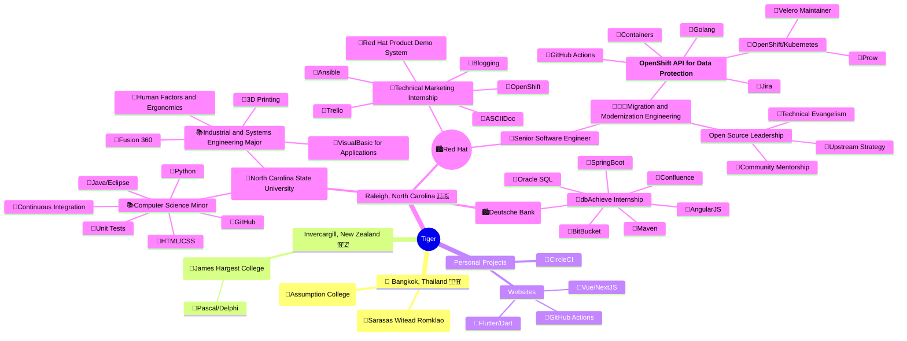
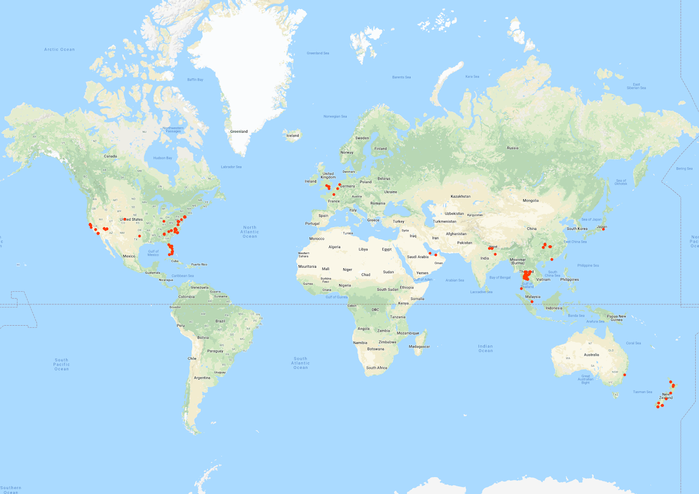

# Tiger Kao (kaovilai)

[Website](https://www.kaovilai.pw), [LinkedIn](https://www.linkedin.com/in/kaovilai/), [Resume](https://resume.kaovilai.pw/), [My Pull Requests](MY_PULL_REQUESTS.md), [My Activity](MY_ACTIVITY.md)

### OSS Accounts
- https://github.com/kaovilai
- https://gitlab.com/kaovilai
- https://bitbucket.org/kaovilaigithub
- https://gitlab.freedesktop.org/kaovilai
- https://pagure.io/user/tiger
- https://crowdin.com/profile/kaovilai

### About Me

Senior Software Engineer at Red Hat, working on [OpenShift API for Data Protection (OADP)](https://github.com/openshift/oadp-operator) and Maintainer of the [Velero](https://github.com/vmware-tanzu/velero) project. Focused on upstream community leadership, mentoring contributors, and architecting cloud-native data protection for Kubernetes.

```mermaid
mindmap
  root((Tiger))
    🐣 Bangkok, Thailand 🇹🇭
        (🏫Sarasas Witead Romklao)
        (🏫Assumption College)
    Invercargill, New Zealand 🇳🇿
        (🏫James Hargest College)
            🍳Pascal/Delphi
    Personal Projects
        Websites
            🍳Flutter/Dart
            🍳Vue/NextJS
            🍳GitHub Actions
        🍳CircleCI
    Raleigh, North Carolina 🇺🇸
        (🏫North Carolina State University)
            📚Computer Science Minor
                🍳Java/Eclipse
                🍳Python
                🍳Unit Tests
                🍳Continuous Integration
                🍳HTML/CSS
                🍳GitHub
            📚Industrial and Systems Engineering Major
                🍳Human Factors and Ergonomics
                🍳VisualBasic for Applications
                🍳Fusion 360
                🍳3D Printing
        ((🏙️Red Hat))
            💼Technical Marketing Internship
                🍳Red Hat Product Demo System
                🍳ASCIIDoc
                🍳OpenShift
                🍳Blogging
                🍳Ansible
                🍳Trello
           💼Senior Software Engineer
                🧑‍🤝‍🧑Migration and Modernization Engineering
                    **OpenShift API for Data Protection**
                        🍳Golang
                        🍳Containers
                        🍳OpenShift/Kubernetes
                            🍳Prow
                            🍳Velero Maintainer
                        🍳Jira
                        🍳GitHub Actions
                    Open Source Leadership
                        🍳Community Mentorship
                        🍳Upstream Strategy
                        🍳Technical Evangelism
        (🏙️Deutsche Bank)
            💼dbAchieve Internship
                🍳SpringBoot
                🍳Maven
                🍳Confluence
                🍳Oracle SQL
                🍳AngularJS
                🍳BitBucket
```

### Education

- **North Carolina State University** - BS Industrial Engineering (2018-2021), Minor in Computer Science (2016-2021)
- **CS50** - Computer Science (2015)
- **James Hargest College** - Invercargill, New Zealand (2012-2015)
- **Assumption College** - Bangkok, Thailand (2010-2012)

### Places

In red below are some places I have lived in, visited, or transited through. Screenshot from Google Maps' Timeline

