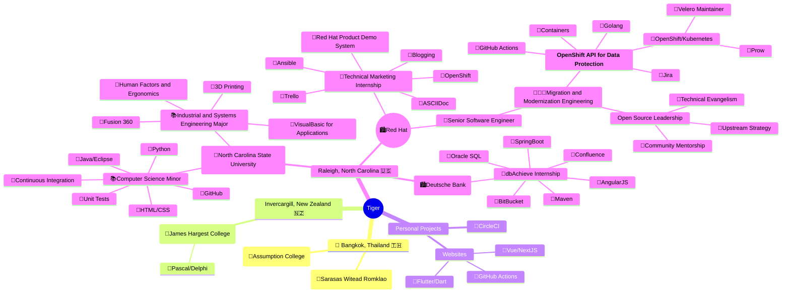
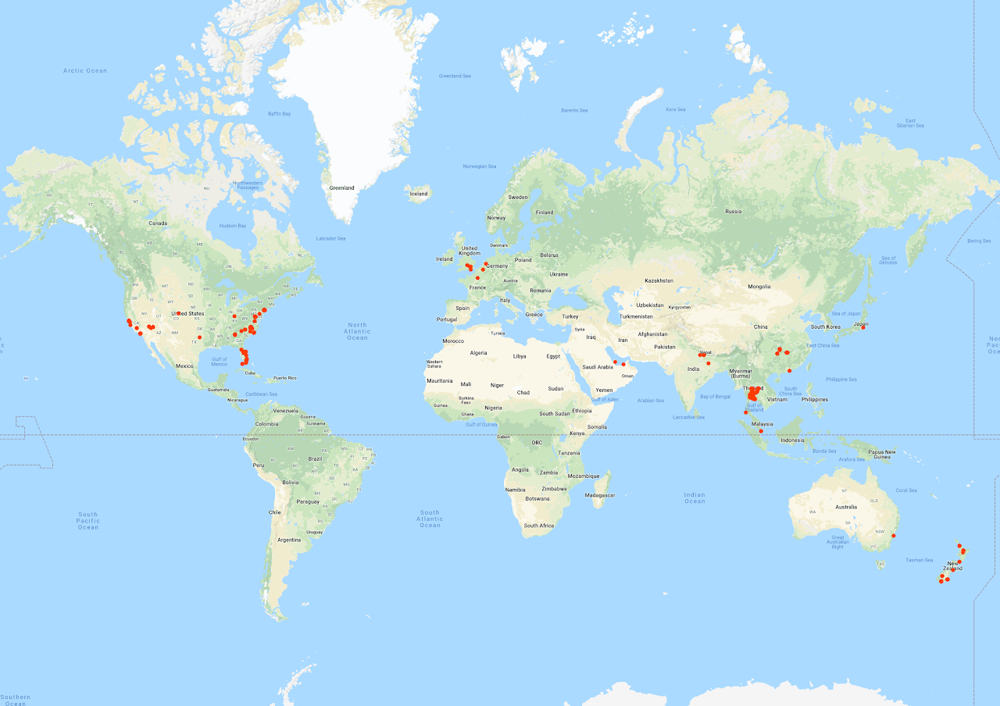

# Tiger Kaovilai (kaovilai)

[Website](https://www.kaovilai.pw), [LinkedIn](https://www.linkedin.com/in/kaovilai/), [Resume](https://resume.kaovilai.pw/), [My Pull Requests](MY_PULL_REQUESTS.md), [My Activity](MY_ACTIVITY.md)

### OSS Accounts
- [GitHub](https://github.com/kaovilai)
- [GitLab](https://gitlab.com/kaovilai)
- [Bitbucket](https://bitbucket.org/kaovilaigithub)
- [freedesktop.org GitLab](https://gitlab.freedesktop.org/kaovilai)
- [Pagure](https://pagure.io/user/tiger)
- [Crowdin](https://crowdin.com/profile/kaovilai)

<a href="https://github.com/kaovilai/github-stats">


</a>

### About Me

Senior Software Engineer at Red Hat, working on [OpenShift API for Data Protection (OADP)](https://github.com/openshift/oadp-operator) and Maintainer of the [Velero](https://github.com/velero-io/velero) project. Focused on upstream community leadership, mentoring contributors, and architecting cloud-native data protection for Kubernetes.


```mermaid
mindmap
  root((Tiger))
    🐣 Bangkok, Thailand 🇹🇭
        (🏫Sarasas Witead Romklao)
        (🏫Assumption College)
    Invercargill, New Zealand 🇳🇿
        (🏫James Hargest College)
            🍳Pascal/Delphi
    Personal Projects
        Websites
            🍳Flutter/Dart
            🍳Vue/NextJS
            🍳GitHub Actions
        🍳CircleCI
    Raleigh, North Carolina 🇺🇸
        (🏫North Carolina State University)
            📚Computer Science Minor
                🍳Java/Eclipse
                🍳Python
                🍳Unit Tests
                🍳Continuous Integration
                🍳HTML/CSS
                🍳GitHub
            📚Industrial and Systems Engineering Major
                🍳Human Factors and Ergonomics
                🍳VisualBasic for Applications
                🍳Fusion 360
                🍳3D Printing
        ((🏙️Red Hat))
            💼Technical Marketing Internship
                🍳Red Hat Product Demo System
                🍳ASCIIDoc
                🍳OpenShift
                🍳Blogging
                🍳Ansible
                🍳Trello
           💼Senior Software Engineer
                🧑‍🤝‍🧑Migration and Modernization Engineering
                    **OpenShift API for Data Protection**
                        🍳Golang
                        🍳Containers
                        🍳OpenShift/Kubernetes
                            🍳Prow
                            🍳Velero Maintainer
                        🍳Jira
                        🍳GitHub Actions
                    Open Source Leadership
                        🍳Community Mentorship
                        🍳Upstream Strategy
                        🍳Technical Evangelism
        (🏙️Deutsche Bank)
            💼dbAchieve Internship
                🍳SpringBoot
                🍳Maven
                🍳Confluence
                🍳Oracle SQL
                🍳AngularJS
                🍳BitBucket
```

### Education

- **North Carolina State University** - BS Industrial Engineering (2018-2021), Minor in Computer Science (2016-2021)
- **CS50** - Computer Science (2015)
- **James Hargest College** - Invercargill, New Zealand (2012-2015)
- **Assumption College** - Bangkok, Thailand (2010-2012)

### Places

In red below are some places I have lived in, visited, or transited through. Screenshot from Google Maps' Timeline



[North Carolina destinations map](nc_destinations.html)

## open-prs.json Schema

`open-prs.json` is automatically generated on the `update-pr-badges` workflow schedule and exported for consumption by [kaovilai.pw](https://www.kaovilai.pw).

### Top-level fields

| Field | Type | Description |
|-------|------|-------------|
| `updatedAt` | string (ISO 8601) | Timestamp of last generation |
| `prs` | array | All open PRs by kaovilai (sorted by org then status priority) |
| `reviewQueue` | object | Professional review-queue panel data |

### `prs[]` item fields

| Field | Type | Description |
|-------|------|-------------|
| `number` | number | PR number |
| `repo` | string | `owner/name` |
| `org` | string | Repository owner/org login |
| `title` | string | PR title |
| `url` | string | PR URL |
| `targetBranch` | string | Base branch |
| `status` | string | Badge status: `ready`, `waiting-merge`, `ci-pending`, `draft`, `stale`, `hold`, `failing-ci`, `needs-attention` |
| `milestone` | string\|null | Linked issue milestone (velero repos only) |
| `author` | string | GitHub login of PR author |
| `isCopilotAuthored` | boolean | True when authored by a Copilot coding-agent bot |
| `assignees` | string[] | Assignee logins |
| `isDraft` | boolean | Draft state |
| `labels` | string[] | Label names |
| `updatedAt` | string (ISO 8601) | Last activity timestamp |

### `reviewQueue` fields

Includes only **public professional contributions** (repos owned by GitHub organizations, not personal accounts). Excludes drafts, rebase-blocked PRs, and merge-conflicted PRs.

| Field | Type | Description |
|-------|------|-------------|
| `updatedAt` | string (ISO 8601) | Timestamp of last generation |
| `needsReview` | array | Open PRs still waiting for human review/approval, sorted by longest waiting first |
| `approvedWaitingToLand` | array | Sufficiently approved PRs still open (CI, merge queue, hold, etc.), sorted by longest waiting first |

### `reviewQueue.needsReview[]` / `reviewQueue.approvedWaitingToLand[]` item fields

| Field | Type | Description |
|-------|------|-------------|
| `number` | number | PR number |
| `repo` | string | `owner/name` |
| `org` | string | Organization login |
| `title` | string | PR title |
| `url` | string | PR URL |
| `targetBranch` | string | Base branch |
| `author` | string | GitHub login of PR author |
| `isCopilotAuthored` | boolean | True when authored by Copilot coding-agent bot |
| `assignees` | string[] | Assignee logins |
| `labels` | string[] | Label names |
| `mergeStateStatus` | string | GitHub merge state: `CLEAN`, `DIRTY`, `BEHIND`, `BLOCKED`, `UNKNOWN`, etc. |
| `isApproved` | boolean | True if sufficiently approved (`reviewDecision` is `APPROVED`, OR both `lgtm`+`approved` Prow labels, OR an approving review when no `reviewDecision` is reported) |
| `hasProwApproval` | boolean | True if both `lgtm` and `approved` labels are present |
| `hasGithubApproval` | boolean | True if at least one native GitHub approving review exists |
| `reviewDecision` | string\|null | GitHub `PullRequest.reviewDecision`: `APPROVED`, `REVIEW_REQUIRED`, or `CHANGES_REQUESTED` (null when reviews are not required). Honors the required approving review count wherever it is configured (direct branch protection or the openshift/release Prow branch-protector) |
| `approvalCount` | number | Number of latest reviews in the `APPROVED` state (one per reviewer) |
| `requiredApprovals` | number\|null | Required approving review count from branch protection rules, falling back to the openshift/release Prow branch-protector config; null when unknown |
| `reviewRequests` | string[] | Requested reviewer/team logins |
| `group` | string | `needsReview` or `approvedWaitingToLand` |
| `reason` | string | Classification reason: `awaitingReview`, `hold`, `pendingMerge` |
| `waitingDays` | number | Days since last activity |
| `updatedAt` | string (ISO 8601) | Last activity timestamp |

### Validation

```bash
bash .github/scripts/validate-open-prs-json.sh open-prs.json
```
