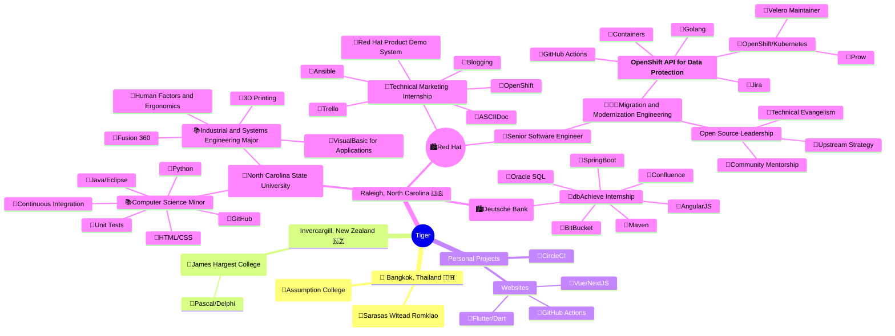
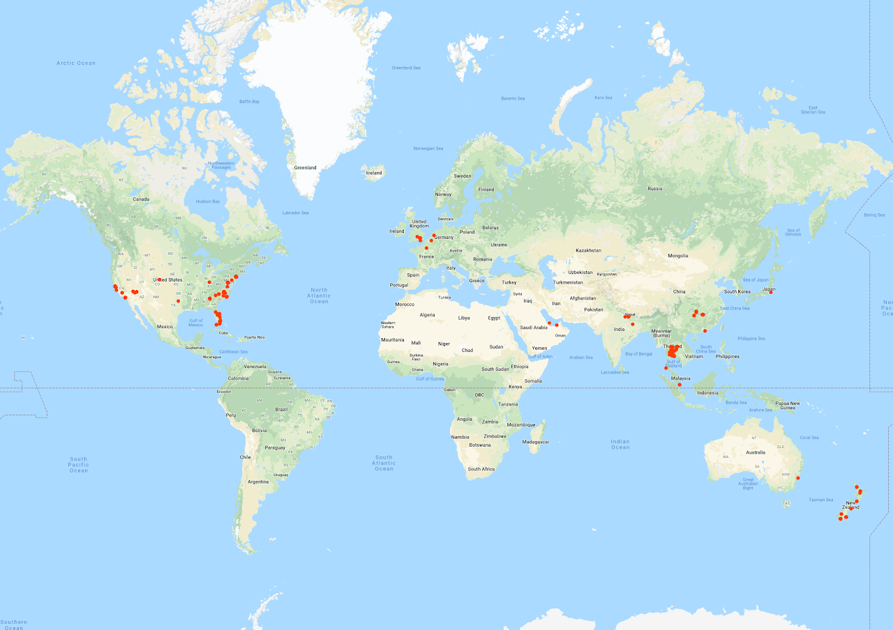

# Tiger Kaovilai (kaovilai)

[Website](https://www.kaovilai.pw), [LinkedIn](https://www.linkedin.com/in/kaovilai/), [Resume](https://resume.kaovilai.pw/), [My Pull Requests](MY_PULL_REQUESTS.md), [My Activity](MY_ACTIVITY.md)

### OSS Accounts
- [GitHub](https://github.com/kaovilai)
- [GitLab](https://gitlab.com/kaovilai)
- [Bitbucket](https://bitbucket.org/kaovilaigithub)
- [freedesktop.org GitLab](https://gitlab.freedesktop.org/kaovilai)
- [Pagure](https://pagure.io/user/tiger)
- [Crowdin](https://crowdin.com/profile/kaovilai)

<a href="https://github.com/kaovilai/github-stats">


</a>

### About Me

Senior Software Engineer at Red Hat, working on [OpenShift API for Data Protection (OADP)](https://github.com/openshift/oadp-operator) and Maintainer of the [Velero](https://github.com/velero-io/velero) project. Focused on upstream community leadership, mentoring contributors, and architecting cloud-native data protection for Kubernetes.


```mermaid
mindmap
  root((Tiger))
    🐣 Bangkok, Thailand 🇹🇭
        (🏫Sarasas Witead Romklao)
        (🏫Assumption College)
    Invercargill, New Zealand 🇳🇿
        (🏫James Hargest College)
            🍳Pascal/Delphi
    Personal Projects
        Websites
            🍳Flutter/Dart
            🍳Vue/NextJS
            🍳GitHub Actions
        🍳CircleCI
    Raleigh, North Carolina 🇺🇸
        (🏫North Carolina State University)
            📚Computer Science Minor
                🍳Java/Eclipse
                🍳Python
                🍳Unit Tests
                🍳Continuous Integration
                🍳HTML/CSS
                🍳GitHub
            📚Industrial and Systems Engineering Major
                🍳Human Factors and Ergonomics
                🍳VisualBasic for Applications
                🍳Fusion 360
                🍳3D Printing
        ((🏙️Red Hat))
            💼Technical Marketing Internship
                🍳Red Hat Product Demo System
                🍳ASCIIDoc
                🍳OpenShift
                🍳Blogging
                🍳Ansible
                🍳Trello
           💼Senior Software Engineer
                🧑‍🤝‍🧑Migration and Modernization Engineering
                    **OpenShift API for Data Protection**
                        🍳Golang
                        🍳Containers
                        🍳OpenShift/Kubernetes
                            🍳Prow
                            🍳Velero Maintainer
                        🍳Jira
                        🍳GitHub Actions
                    Open Source Leadership
                        🍳Community Mentorship
                        🍳Upstream Strategy
                        🍳Technical Evangelism
        (🏙️Deutsche Bank)
            💼dbAchieve Internship
                🍳SpringBoot
                🍳Maven
                🍳Confluence
                🍳Oracle SQL
                🍳AngularJS
                🍳BitBucket
```

### Education

- **North Carolina State University** - BS Industrial Engineering (2018-2021), Minor in Computer Science (2016-2021)
- **CS50** - Computer Science (2015)
- **James Hargest College** - Invercargill, New Zealand (2012-2015)
- **Assumption College** - Bangkok, Thailand (2010-2012)

### Places

In red below are some places I have lived in, visited, or transited through. Screenshot from Google Maps' Timeline



[North Carolina destinations map](nc_destinations.html)

## open-prs.json Schema

`open-prs.json` is automatically generated on the `update-pr-badges` workflow schedule and exported for consumption by [kaovilai.pw](https://www.kaovilai.pw).

### Top-level fields

| Field | Type | Description |
|-------|------|-------------|
| `updatedAt` | string (ISO 8601) | Timestamp of last generation |
| `prs` | array | All open PRs by kaovilai (sorted by org then status priority) |
| `reviewQueue` | object | Professional review-queue panel data |

### `prs[]` item fields

| Field | Type | Description |
|-------|------|-------------|
| `number` | number | PR number |
| `repo` | string | `owner/name` |
| `org` | string | Repository owner/org login |
| `title` | string | PR title |
| `url` | string | PR URL |
| `targetBranch` | string | Base branch |
| `status` | string | Badge status: `ready`, `waiting-merge`, `ci-pending`, `draft`, `stale`, `hold`, `failing-ci`, `needs-attention` |
| `milestone` | string\|null | Linked issue milestone (velero repos only) |
| `author` | string | GitHub login of PR author |
| `isCopilotAuthored` | boolean | True when authored by a Copilot coding-agent bot |
| `assignees` | string[] | Assignee logins |
| `isDraft` | boolean | Draft state |
| `labels` | string[] | Label names |
| `updatedAt` | string (ISO 8601) | Last activity timestamp |
| `workstream` | string | Default workstream classification (`Velero` — includes the official Velero plugin repos, `OADP`, `KubeVirt Data Mover`, `Kubernetes` — `kubernetes/*`/`kubernetes-sigs/*`, e.g. Prow, kubectl, `CNCF Landscape`, or `Uncategorized`) — see [workstream-classification.json](#workstream-classificationjson) for overrides |
| `ciChecks` | array | Normalized `[{name, conclusion}]` CI checks from `statusCheckRollup`, with merge-queue noise (Tide, Auto Request Review) filtered out |

### `reviewQueue` fields

Includes only **public professional contributions** (repos owned by GitHub organizations, not personal accounts). Excludes drafts, rebase-blocked PRs, and merge-conflicted PRs.

| Field | Type | Description |
|-------|------|-------------|
| `updatedAt` | string (ISO 8601) | Timestamp of last generation |
| `needsReview` | array | Open PRs still waiting for human review/approval, sorted by longest waiting first |
| `approvedWaitingToLand` | array | Sufficiently approved PRs still open (CI, merge queue, hold, etc.), sorted by longest waiting first |

### `reviewQueue.needsReview[]` / `reviewQueue.approvedWaitingToLand[]` item fields

| Field | Type | Description |
|-------|------|-------------|
| `number` | number | PR number |
| `repo` | string | `owner/name` |
| `org` | string | Organization login |
| `title` | string | PR title |
| `url` | string | PR URL |
| `targetBranch` | string | Base branch |
| `author` | string | GitHub login of PR author |
| `isCopilotAuthored` | boolean | True when authored by Copilot coding-agent bot |
| `assignees` | string[] | Assignee logins |
| `labels` | string[] | Label names |
| `mergeStateStatus` | string | GitHub merge state: `CLEAN`, `DIRTY`, `BEHIND`, `BLOCKED`, `UNKNOWN`, etc. |
| `isApproved` | boolean | True if sufficiently approved (`reviewDecision` is `APPROVED`, OR both `lgtm`+`approved` Prow labels, OR an approving review when no `reviewDecision` is reported) |
| `hasProwApproval` | boolean | True if both `lgtm` and `approved` labels are present |
| `hasGithubApproval` | boolean | True if at least one native GitHub approving review exists |
| `reviewDecision` | string\|null | GitHub `PullRequest.reviewDecision`: `APPROVED`, `REVIEW_REQUIRED`, or `CHANGES_REQUESTED` (null when reviews are not required). Honors the required approving review count wherever it is configured (direct branch protection or the openshift/release Prow branch-protector) |
| `approvalCount` | number | Number of latest reviews in the `APPROVED` state (one per reviewer) |
| `requiredApprovals` | number\|null | Required approving review count from branch protection rules, falling back to the openshift/release Prow branch-protector config; null when unknown |
| `reviewRequests` | string[] | Requested reviewer/team logins |
| `group` | string | `needsReview` or `approvedWaitingToLand` |
| `reason` | string | Classification reason: `awaitingReview`, `hold`, `pendingMerge` |
| `waitingDays` | number | Days since last activity |
| `updatedAt` | string (ISO 8601) | Last activity timestamp |

### Validation

```bash
bash .github/scripts/validate-open-prs-json.sh open-prs.json
```

## open-issues.json Schema

`open-issues.json` is generated by the `update-issues-list` workflow (same schedule as PR badges), mirroring `open-prs.json` for issues: authored, assigned, commented-on (last 90 days), and — for `openshift`/`openshift-eng` specifically — anything I'm otherwise involved in (mentioned, review-requested), since those are my employer's orgs.

| Field | Type | Description |
|-------|------|-------------|
| `number`, `repo`, `org`, `title`, `url`, `labels`, `updatedAt`, `workstream` | — | Same meaning as `open-prs.json` |
| `status` | string | `open` or `stale` (no activity in 60+ days) |
| `author` | string | Issue author login |
| `relation` | string | Why this issue is tracked: `author`, `assignee`, `commenter`, or `involved` |
| `assignees` | string[] | Assignee logins |

Validate with `bash .github/scripts/validate-open-issues-json.sh open-issues.json`.

## workstream-archive.json Schema

Append-only historical catalog of **closed/merged** PRs and issues, going back to the start of my public GitHub activity (not just a rolling window). Once an item lands here it's treated as a immutable snapshot — the incremental refresh (`update-history-archive` workflow, daily) only re-touches an entry if it reopens or gets a new comment after close; quiet closed items cost zero API calls on every future run.

| Field | Type | Description |
|-------|------|-------------|
| `generatedAt` | string (ISO 8601) | Last refresh timestamp — also the cursor the incremental refresh queries `--updated=">="` from |
| `items[]` | array | `{number, repo, org, title, url, type: "pr"\|"issue", state: "closed"\|"merged", createdAt, closedAt, updatedAt, workstream}` |

Seeding a fresh archive (or re-seeding from scratch) is manual, not scheduled:

```bash
bash .github/scripts/backfill-history.sh   # one-time, all-time, windowed by year
```

## workstream-classification.json / workstream-layout.json

Manual override layer for the `/workstream/` dashboard — never touched by the scheduled data-collection workflows.

- `workstream-classification.json`: keyed by `org/repo` or `org/repo#123`, each entry `{workstream, source: "default"|"auto"|"manual", note}`. `source: "manual"` entries are permanent — the `categorize-workstream` gh-aw workflow (daily, opens a PR for review) will never touch them, only proposing `source: "auto"` classifications for items the default regex rules leave `Uncategorized`.
- `workstream-layout.json`: `{laneOrder: [...], pinned: {laneName: [itemKeys...]}}` — manual lane ordering and drag-to-reorder pins from the dashboard.

## /workstream/ — Workstream Tree dashboard

A vertical timeline across Velero (including its plugin repos), OADP, KubeVirt Data Mover, Kubernetes (`kubernetes/*`/`kubernetes-sigs/*` — split from CNCF Landscape since it's Kubernetes-specific work, not general CNCF-wide), and CNCF Landscape work: "now" at the top, scroll down for history (same px-per-day scale throughout; pinch/ctrl+scroll to zoom), colored + iconed by status (never color alone — colorblind-safe palette), with CI status per PR and a freshness banner since that data is only as fresh as the last scheduled run.

To review and annotate locally, with edits committed and pushed so they show up on the live site:

```bash
bash workstream/serve.sh            # starts a local server at http://localhost:8420/workstream/
bash workstream/refresh-data.sh     # pulls fresh data on demand, between scheduled runs
```

Click a card to add a note or override its workstream; drag to reorder within a lane or drop onto a different lane to reclassify. "Save & Publish" writes `workstream-classification.json`/`workstream-layout.json` and runs a signed-off `git commit` + `push` via the local server — so it only ever touches those two files, never the auto-collected data. Without the local server running, edits fall back to browser `localStorage` only.

