[Website](https://www.kaovilai.pw), [LinkedIn](https://www.linkedin.com/in/kaovilai/), [Resume](https://resume.kaovilai.pw/)

### OSS Accounts
- https://github.com/kaovilai
- https://gitlab.com/kaovilai
- https://bitbucket.org/kaovilaigithub
- https://gitlab.freedesktop.org/kaovilai
- https://pagure.io/user/tiger
- https://crowdin.com/profile/kaovilai

<!-- work tracker - red hat login required to see -->

### About Me

Currently a Red Hat Software Engineer working on Data Protection on OpenShift platform.

```mermaid
mindmap
  root((Tiger))
    🐣 Bangkok, Thailand 🇹🇭
        (🏫Sarasas Witead Romklao)
        (🏫Assumption College)
    Invercargill, New Zealand 🇳🇿
        (🏫James Hargest College)
            🍳Pascal/Delphi
    Personal Projects
        Websites
            🍳Flutter/Dart
            🍳Vue/NextJS
            🍳GitHub Actions
        🍳CircleCI
    Raleigh, North Carolina 🇺🇸
        (🏫North Carolina State University)
            📚Computer Science Minor
                🍳Java/Eclipse
                🍳Python
                🍳Unit Tests
                🍳Continuous Integration
                🍳HTML/CSS
                🍳GitHub
            📚Industrial and Systems Engineering Major
                🍳Human Factors and Ergonomics
                🍳VisualBasic for Applications
        ((🏙️Red Hat))
            💼Technical Marketing Internship
                🍳Red Hat Product Demo System
                🍳ASCIIDoc
                🍳OpenShift
                🍳Blogging
                🍳Ansible
                🍳Trello
           💼Software Engineer
                🧑‍🤝‍🧑Migration and Modernization Engineering
                    **OpenShift API for Data Protection**
                        🍳Golang
                        🍳Containers
                        🍳OpenShift/Kubernetes
                            🍳Prow
                            🍳Velero
                        🍳Jira
                        🍳Travis
        (🏙️Deutsche Bank)
            💼dbAchieve Internship
                🍳SpringBoot
                🍳Maven
                🍳Confluence
                🍳Oracle SQL
                🍳AngularJS
                🍳BitBucket
```

In red below are some places I have lived in, visited, or transited through. Screenshot from Google Maps' Timeline

